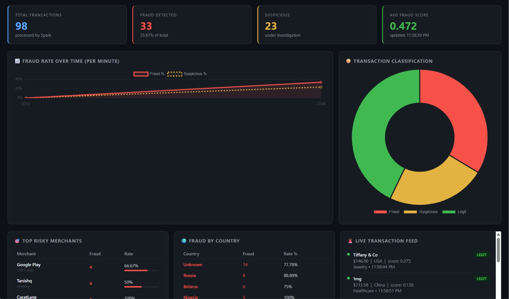
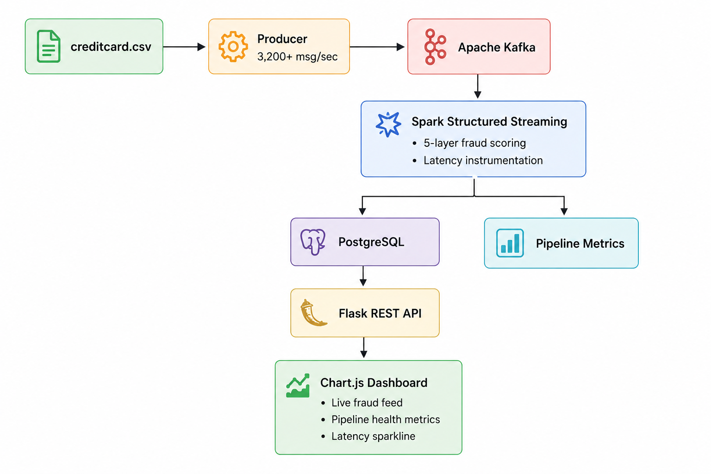

# 🔍 Fraud Detection Pipeline

A production-style, end-to-end streaming fraud detection system built with
Apache Kafka, Spark Structured Streaming, PostgreSQL, and Flask.

**3,200+ msg/sec throughput · 83.5% precision · 82.7% recall · Dockerized**

---

## Dashboard Preview

<p align="center">
  
</p>

Real-time monitoring dashboard showing:

- Live fraud detection feed
- Pipeline health metrics
- Throughput monitoring
- End-to-end latency tracking
- Fraud score distribution

---

## Architecture

<p align="center">
  
</p>

### Flow

1. **creditcard.csv** is streamed by a high-throughput Kafka producer.
2. **Apache Kafka** acts as the event backbone.
3. **Spark Structured Streaming** performs real-time fraud scoring and latency instrumentation.
4. Results are persisted to **PostgreSQL**.
5. Metrics are collected separately for observability.
6. **Flask REST API** serves analytics and monitoring endpoints.
7. **Chart.js Dashboard** visualizes transactions, fraud alerts, and pipeline health in real time.

---

## Benchmark Results

Offline evaluation on the ULB Credit Card Fraud dataset comparing the
pipeline's rule-based scorer against trained ML baselines.

| Model | Precision | Recall | F1 | AUC-ROC |
|--------|-----------|--------|--------|---------|
| Random Forest ✅ | 0.8351 | 0.8265 | 0.8308 | 0.9644 |
| Logistic Regression | 0.1350 | 0.8980 | 0.2347 | 0.9772 |
| Rule-Based (Pipeline) | 0.0293 | 0.5408 | 0.0556 | N/A |

> **Methodology:** 80/20 train-test split (stratified), SMOTE applied to
> training data only to address the 0.17% class imbalance. Test set:
> 56,962 transactions. Random Forest achieved the best overall F1 score.

---

## Pipeline Performance

| Metric | Value |
|----------|---------|
| Producer Throughput | 3,200+ msg/sec |
| Avg Pipeline Latency | ~5 seconds |
| Microbatch Interval | 2 seconds |
| Containerized | Docker Compose |

> **Latency Measurement:** End-to-end timing from Kafka produce to PostgreSQL write with Kafka, Spark, PostgreSQL, and Flask running on a single machine. Production deployments with dedicated infrastructure can reduce latency significantly.

---

## Tech Stack

| Layer | Technologies |
|---------|-------------|
| Streaming | Apache Kafka, Spark Structured Streaming (PySpark) |
| Storage | PostgreSQL |
| Backend | Python, Flask, psycopg2 |
| Frontend | HTML, JavaScript, Chart.js |
| DevOps | Docker, Docker Compose |
| ML Evaluation | scikit-learn, imbalanced-learn (SMOTE) |
| Dataset | ULB Credit Card Fraud Dataset |

---

## Project Structure

```text
FRAUD-DETECTION-PIPELINE/
│
├── api/                    # Flask REST API
├── benchmark/
│   ├── evaluate.py         # ML benchmark
│   └── results.json
├── configs/                # Configuration
├── dashboard/              # Chart.js frontend
├── docker/                 # Docker Compose setup
├── producer/               # Kafka producer
├── streaming/              # Spark streaming engine
├── requirements.txt
├── Makefile
├── start_pipeline.bat
└── .env.example
```

---

## Quick Start

### Prerequisites

- Docker + Docker Compose
- Python 3.8+
- Download `creditcard.csv` from Kaggle and place it in:

```text
data/creditcard.csv
```

### Run the Pipeline

```bash
# Install dependencies
pip install -r requirements.txt

# Configure environment
cp .env.example .env

# Start services
make up              # Linux/Mac
start_pipeline.bat   # Windows

# Open dashboard
http://localhost:5000

# Stop services
make down            # Linux/Mac
stop_pipeline.bat    # Windows
```

### Run Benchmark

```bash
python benchmark/evaluate.py
```

---

## Dataset

**ULB Credit Card Fraud Detection Dataset**

- 284,807 transactions
- 492 fraud cases
- 0.172% fraud rate

Used for both streaming simulation and offline benchmark evaluation.

---

## Key Features

- Real-time fraud scoring with Spark Structured Streaming
- Apache Kafka event-driven architecture
- PostgreSQL-backed transaction persistence
- Live monitoring dashboard with Chart.js
- End-to-end latency instrumentation
- Dockerized deployment
- ML benchmark suite for performance comparison
